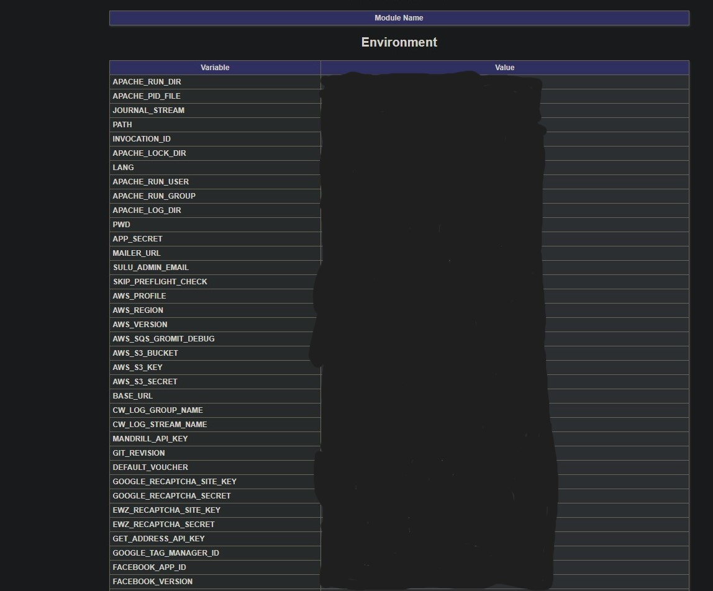

While I am manually going through target websites I always run automated scanning in the background. It rarely finds a real reportable vulnerability and a lot of it is either informational even if it says low or medium or companies tend to run vulnerable versions of software that are patched so the vulnerabilities aren’t exploitable, but I still enjoy looking up what it sees and learning about that specific issue or CVE.

This time the automated scanner picked up an exposed phpinfo page. For Penetration tests, these are considered information disclosure as they give out a lot of information such as the PHP version, operating system and its version, details of configurations and internal IP addresses as well as other information that potential threat actors could utilize. However, on bug bounty programs, these tend to get closed as informational so I tend to skip checking for them manually.

## The Finding

I scrolled through the phpinfo found on one of their subdomains and I could not believe what was exposed in the environment section!

I quickly used keyhacks (https://github.com/streaak/keyhacks) to test the aws_secret and it was current! I stopped there and did not check the full impact of this aws key or the validity of the other keys I found on this page as this was a VDP and I had more than enough proof to submit as I was not going for impact $$$. After reporting this they very quickly locked it down and rotated all the exposed keys. Sadly this was a VDP on HackerOne so I got no reward for it.

## Lessons Learned

While I did not receive a reward for this it did teach me something rather valuable. I tended to pass these pages up as I have seen so many of them and felt like I knew always what I would find there and that it would only be an informational finding. Now I know the value of checking everything anyway!
