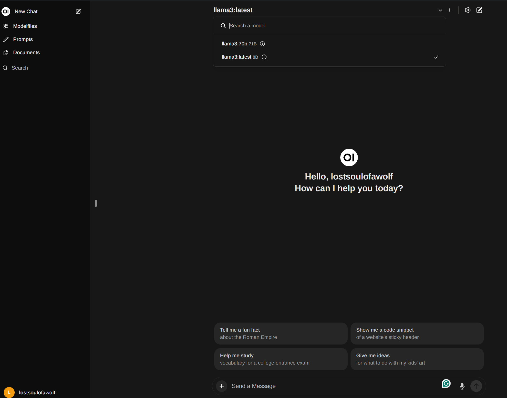

I recently decided to install and run LLaMA 3, a popular AI model for generating human-like text, on my local machine. As someone who's interested in exploring the capabilities and security of AI, I wanted to experience firsthand how this technology can be used.
### Installation
The installation process was surprisingly straightforward when using ollama. And it has support for Windows, Linux, and macOS. So first visit https://ollama.com/ and select Download. This just brings us to a page to select the operating system we will be using for the instal.

I started out using the Linux install on Ubuntu over WSL. This worked great until I wanted to add Open WebUI and after installing it I realized it was just stuck having server connections errors and I was forced to use the docker `--network=host` options. This wasn't alright with me as I wanted to use the LLM over my entire home network so instead of a deep dive into attempting to make the WSL work, I simply choose to use Windows.

Since I am using Windows I downloaded the OllamaSetup.exe from the download options. Run the installer and follow the quick installation wizard's instructions.

Congrats! You're all set!

To run ollama from Windows, open the command prompt or powershell and enter the below command:

`ollama run llama3:latest`

This will grab the latest 8b model if it isn't already on the system and run once downloaded. Currently there are two main models for llama3 and they are 8b and 70b.

Most local environments will want to run the 8b model as the hardware requirements of the 70b model are more than just about any regular has in their home system! But definitely feel free to grab all the models you feel like playing with - I definitely did! But I do suggest starting out with the 8b model when first setting up as its super quick to download and test that everything is working well first.

### Adding Open WebUI
To add a nice UI similuar to ChatGPT we can utilize Open WebUI. It will require Docker to be installed and the command to run the Docker is:

`docker run -d -p 3000:8080 --add-host=host.docker.internal:host-gateway -v open-webui:/app/backend/data --name open-webui --restart always ghcr.io/open-webui/open-webui:main`

Then simply navigate to http://127.0.0.1:3000/auth/ and select 'Sign up' to create an account. Then select the model you wish to use at the top middle drop down menu and start sending prompts! or payloads, I wont judge!

### Conclusion

One of the most impressive aspects of the llama 3 70b model is its ability to generate coherent text based on the input it receives.

The 8b model was impressively fast but the results were often far less desirable or completely inaccurate. In contrast, the 70b model showed a marked improvement in output quality.

I look forward to digging into creating the best prompts to make these models work even more efficiently and to begin my LLM security testing journey!

This has been my experience with installing and running llama 3 locally. If you're interested in exploring the possibilities of AI for yourself, I highly recommend giving it a try.
