Firstly, I want to give credit to Heath Adams at TCM Security. The Practical
Ethical Hacking course helped me learn more than any book and the hands on
learning was just what I needed!

### The Lab

* 1 Windows Server 2019
* 2 Windows 10 Enterprise

### Requirements

* 60 GB Disk Space
* 16 GB RAM

### Downloading the Necessary ISOs

If you are able to get the ISOs from Microsoft Evaluation Center please feel
free to do so. You can find it with Google search as it should be the first option
that appears.

I however, did not have any luck getting ISOs to finish downloading from here as they
would always fail after a short bit. So I used https://tb.rg-adguard.net/public.php
instead. As the ISOs on this site are legit and sourced directly from the MS servers.

For Windows 10 Enterprise:
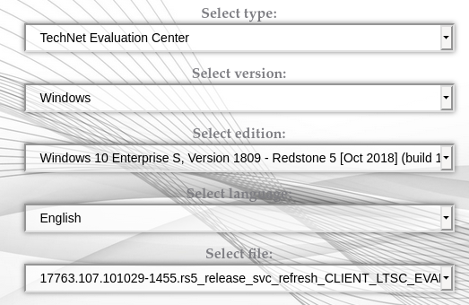

For Windows Server 2019:
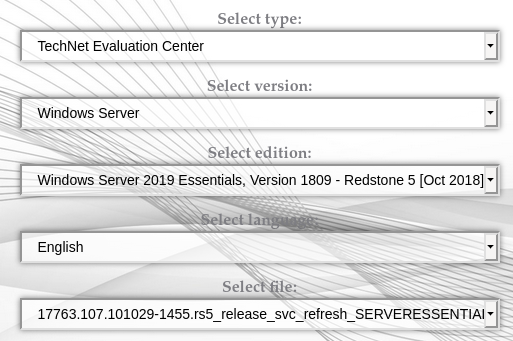

### Setting Up the Domain Controllers

I will be using Oracle VM VirtualBox for this out of personal preference but feel free to use whatever you are comfortable with or step out of your comfort zone and learn something new!

Firstly, well setup the Windows Server 2019. Click `Machine` and `New` and give your virtual machine a name. Set the machine folder to a location of your choosing, making sure you have the required space on that drive. Set the type to Windows and version to Windows 2019 (64-bit). I left the memory size at the minimum 2GB but feel free to bump it up if you'd like and have the RAM to do so.

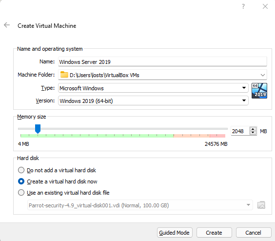

In the next window you will be creating the virtual hard disk. Set this to 60GB and leave it to dynamically allocated then click create.

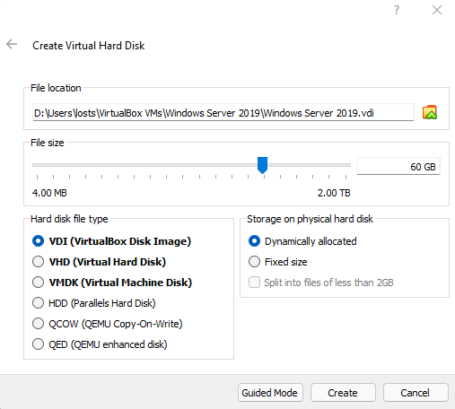

Right click the newly created VM and click on settings. Go to System and uncheck Floppy.

Then go to Storage and select the Empty CD storage. On the right side there is a disc icon, click it and select `choose a disk file` and choose your server ISO. If you aren't sure which ISO is which. The server ISO file will have SERVERESSENTIALS in the name.

Leave the Network set to NAT and click ok. Go ahead and start the machine. It asked me to select the start-up disk so I changed that from the default GuestAdditons.iso to the Windows Server ISO and click start.

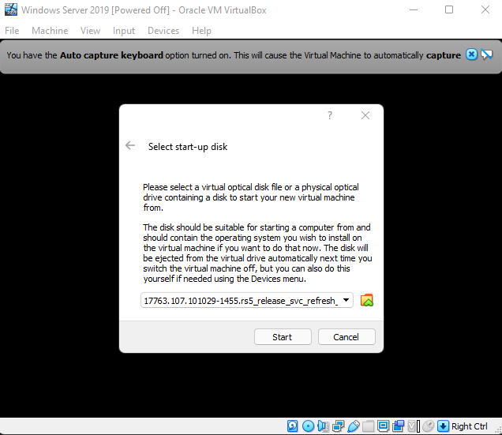

Select your language information and click `Next`.

Then click `Install Now`.

Select `I don't have a licence key` and `Next`. Accept the license terms and click `Next` again. Select the `Custom: Install Windows only (advanced)`.

On the Where do you want to install Windows window select `New` and `Apply` then click `Next` and wait for the install to finish.

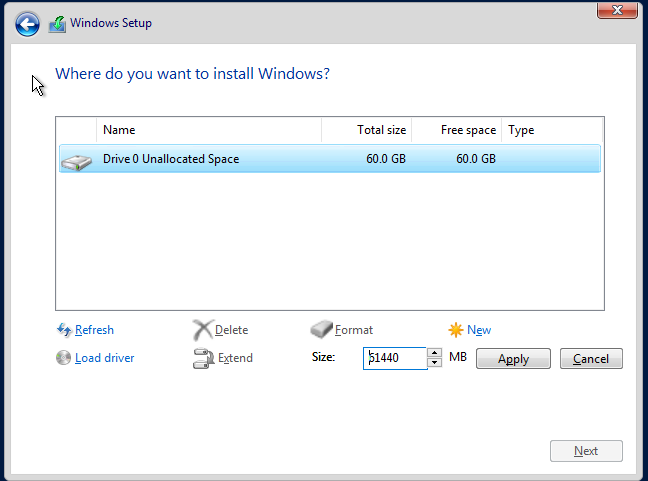

When it finishes it asks you to set a password for the Administrator account. I set mine to `P@$$w0rd!` but as this is your own virtual environment you can set it to whatever you wish as long as you remember it! Click finish to finally get to the Windows login. It asks you to press ctrl+alt+delete to unlock. To do this on VirtualBox go to `Input` then `Keyboard` and select `Insert Ctrl+Alt+Del`.

If you are using VMWare you may have to setup VMWare Tools here to get a properly sized screen. The thing I love about VirtualBox is that I can just select the display size within the running machine settings and VirtualBox resizes properly without the need to install Tools usually.

Next click `Start` and type in `Computer`. Select where it says `View your PC name`. Here you want to scroll down and select `Rename this PC` and name it whatever you want and restart.

After you log back into Windows the Server Manager should open. If it does not go ahead and start it up. Next you'll want to go to `Manage` and `Add Roles and Features`.

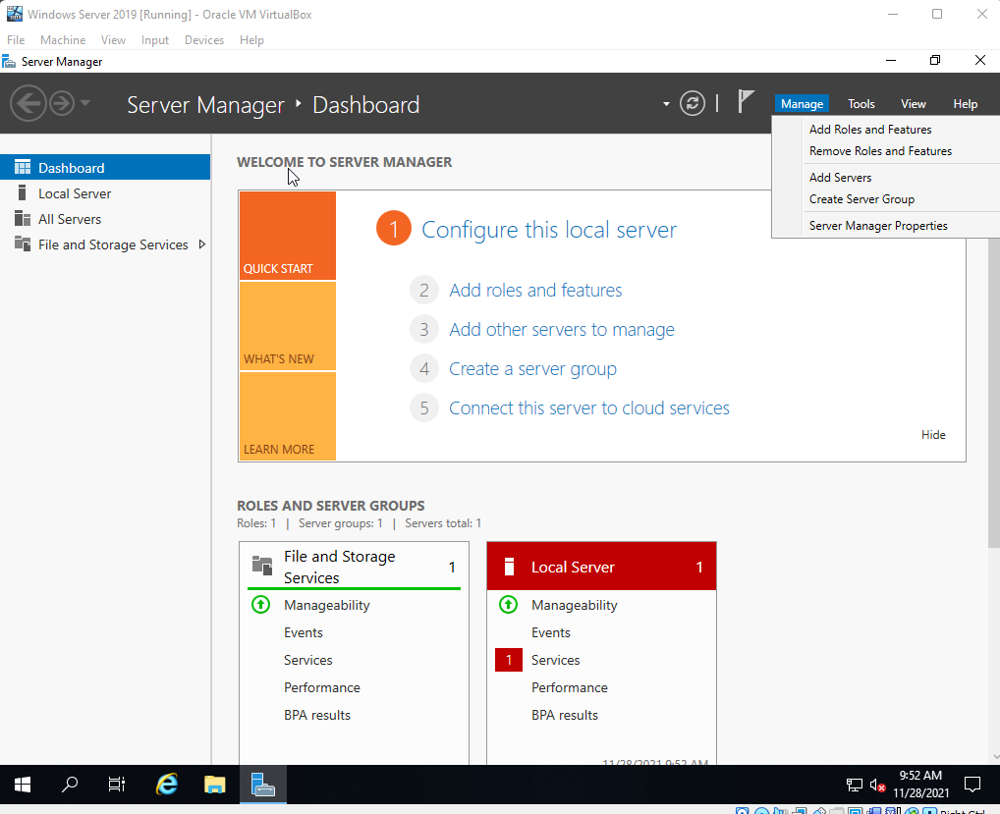

Select `Next` here. Keep it at the default `Role-based or feature-based installation` and click `Next`. Select `Next` again. On Server Roles you want to select `Active Directory Domain Services`, click `Add Features` and select `Next`. Select `Next` again. Select `Next` again and then `Install`.

Now a flag will appear at the top and selecting it will alert us to the fact that we now have to `Promote this server to a domain controller`. So go ahead and select that now.

Select `Add a new forest` and give it a `Root domain name` of your choosing and select `Next`. Give it a password and click `Next`. Click `Next` till you get to the option to `Install` and select it.

### Setting Up the User Machines

For this part you will want to repeat the entire process at least once so that you have at least two client machines. Just like before if you are using VirtualBox go to `Machine` and `New` and set it like below the select `Create`.

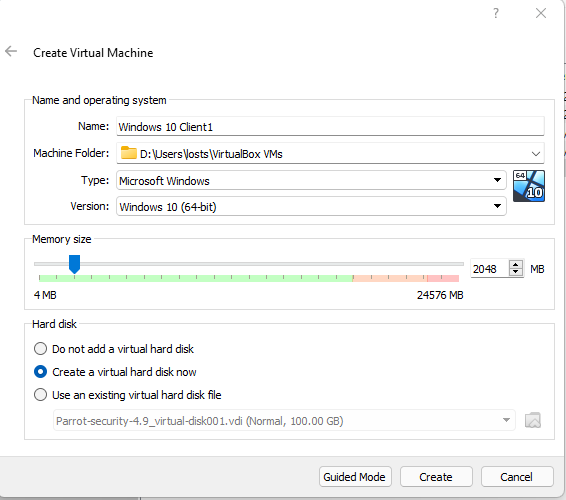

Again change the size to 60GB and the other settings can stay at their defaults then click `Create`. Right click and select `Settings` then `System` and uncheck that floppy from the boot order. Then select `Storage` then `Empty` and the disc icon to `Choose a disk file`. Select the CLIENT ISO file this time and click `OK`.

Start the machine and select the CLIENT ISO file again if prompted to select a start-up disk. Check that the language settings are how you want them and select `Next` then `Install Now`. Check the box to accept the terms and click `Next`. Select `Custom: Install Windows only (advanced)`, this brings you to a new window to choose where you want to install Windows. Click `New` and `Apply` then `Next` after its done making the partitions. 

After it restarts you will need to select a region and keyboard layout. Once you get the option to sign in you'll want to click `Domain join instead`.

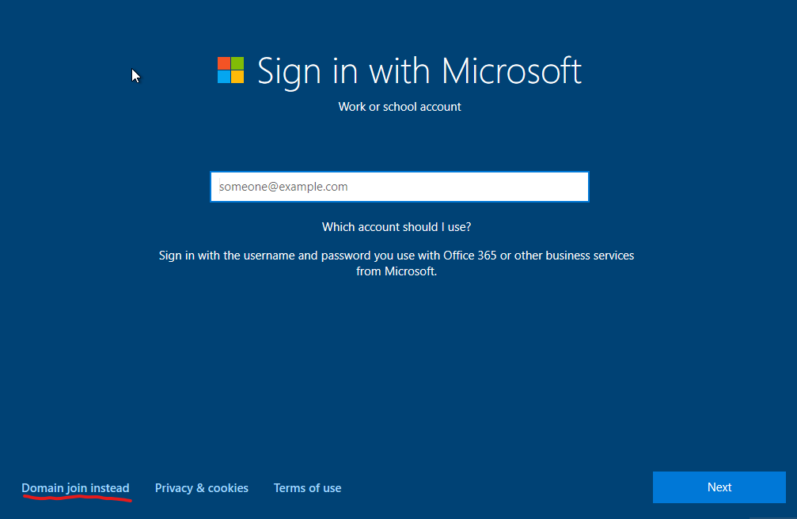

Give it a name and click `Next`. Give it a password, here I just used P@$$w0rd1 to make it easier to remember, then click `Next`. Fill out the security questions with whatever you wish and click `Next`. Click `No` at this next screen. Change everything to `No` if you like on the privacy settings page and then click `Accept`. 

Again you may have to install Tools if you are using VMWare. After it finishes loading the Windows desktop you will want to click `Start` and search `computer` then select `View your PC name`. Scroll down to `Rename this PC` and give it a name of your choosing and reboot.

Do this all again for at least one more Windows 10 client before moving onto the next section.

### Setting Up Users, Groups, and Policies

Start up your domain controller machine and login. Open up the Server Manager if it does not start automatically. Next select `Tools` from the menu on the right side and `Active Directory Users and Computers` from that drop down menu.

Expand the domain controller list and you will see the default directories `Builtin`, `Computers`, `Domain Controllers`, `ForeignSecurityPrincipals`, `Managed Service Accounts`, and `Users`. 

The next step is optional and is more of a quality of life step:

- We want to create a new one for groups so right click the domain controller and select `New` and `Organizational Unit` and name it `Groups` then click `OK`. The click on `Users` and move everything that has the `Type` as `Security Group - *` to the newly created `Groups` folder.

Now we will want to add the users from our client machines into the `Users` directory. To do this you will want to click anywhere on the right in the empty space under Administrator and Guest then hover over `New` and select `User`.

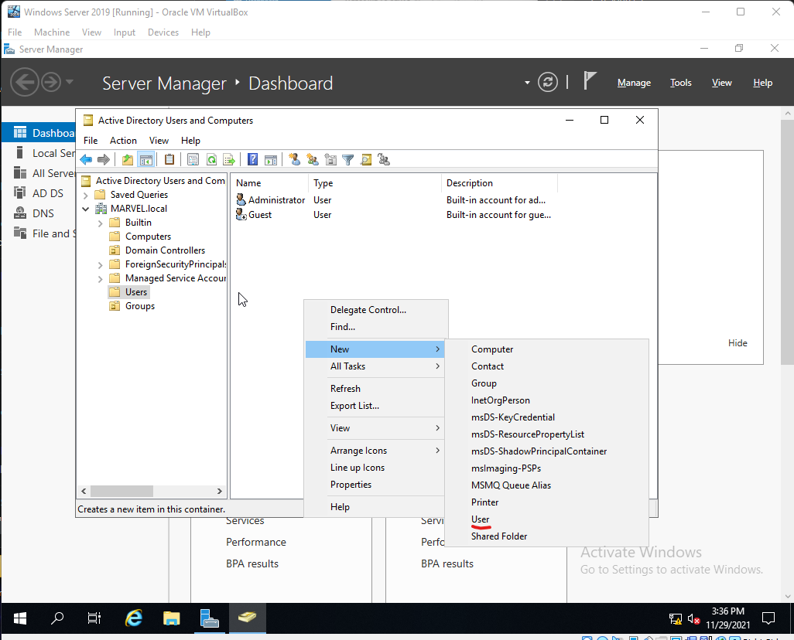

Add the user logins you made for the clients here for the `First name` and `Last name` fields and come up with a naming convention that will be consistent for the `User Login name` field, ie. first initial and last name.
Click `Next` and give the user a password. Note you can set the password to never expire in this virtual test environment but its not something you would realistically want to do. Repeat for however many users you wish to add.For one of the users be sure to make a copy of the `Administrator` user to easily create a user that will be the domain administrator. 

If you are building this lab for testing purposes you may choose to create a copy of the domain administrator account and make it a  SQL Service account. Just set the First Name as SQL and Last as Service and the login name as SQLService. Then right click the SQL Service user and give it a description that tells the password and click `Apply` and figure out how you can view that description without being a domain administrator as descriptions often contain valuable information.

Next lets set up a file share. Close this window and select `File and Storage Services` under Server Manager.

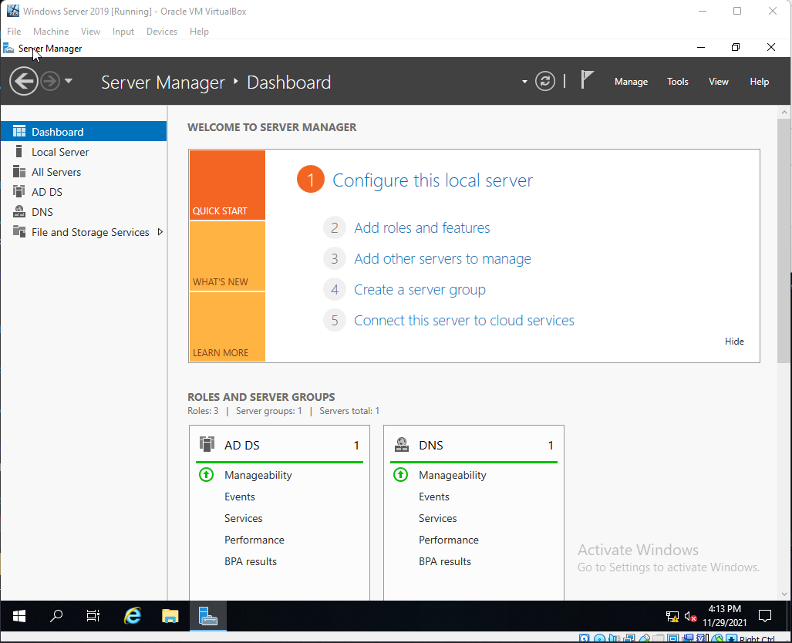

Click on `Shares` and at the top right where it says `TASKS` click there and then `New Share`.

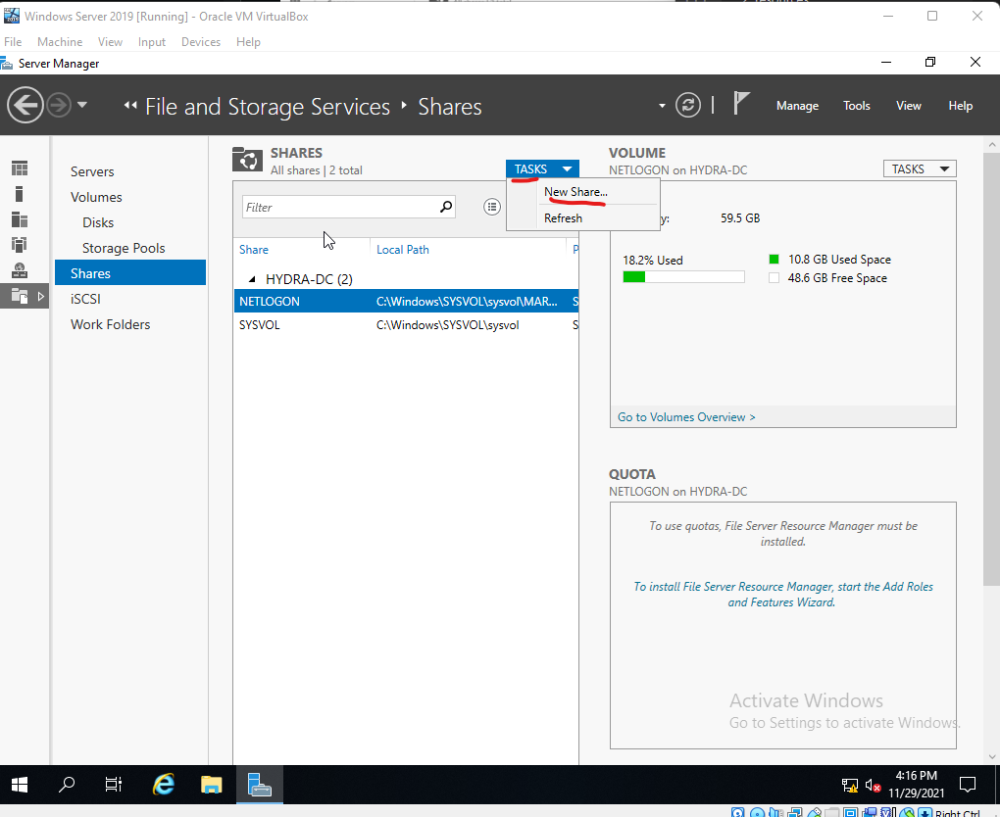

Leave it at the default `SMB Share - Quick` and click `Next`. Click `Next` again and now give it a `Share name` and click `Next` until you get the option to `Create`. Select `Create` then close once it finishes. Most domain controllers have shares so doing this opens the ports and gives us another attack vector to play around with.

Next we want to create a service principal name(SPN) so we can play around with Kerberoasting attack so we need to open a command prompt as Administrator. Enter the following on command prompt:

`setspn -a DOMAINCONTROLLERPCNAME/SQLService.FORESTNAME:60111 FORESTNAME\SQLService`

Then:

`setspn -T FORESTNAME -Q */*`

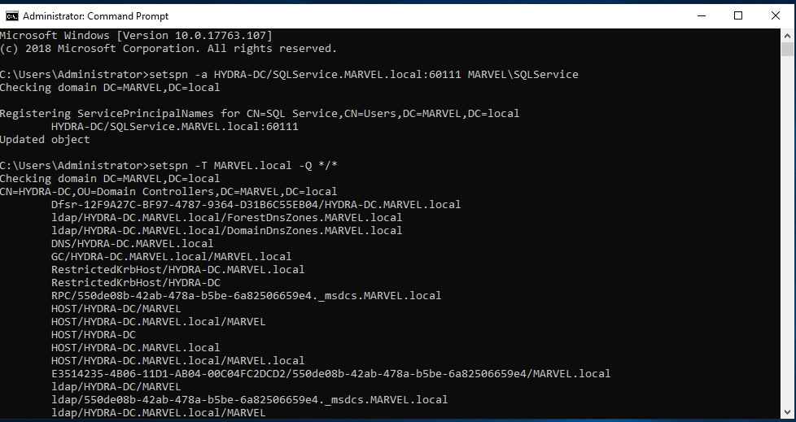

As this is a testing environment we will want to make things easier and disable Windows Defender for now. Click start then type in `Group Policy Management` until it pops up then right click it and select run as Administrator. 

Expand the `Forest` and `Domains` then right click the domain and select `Create a GPO in this domain, and Link it here..`. 

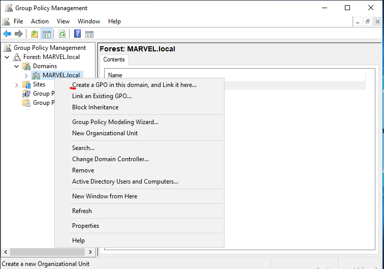

Name it `Disable Windows Defender` and click `OK`. Now expand this tree so you see the newly created `Disable Windows Defender` then right click it and select `Edit`. Next Expand `Policies`, then `Administrative Templates`, then `Windows Components` and finally click `Windows Defender Antivirus`. Double click on `Turn off Windows Defender Antivirus` and select `Enabled` then `Apply` and `OK`.

By default the `Enforced` is set to `No`. Right click this and select `Enforced` to change this to `Yes`.

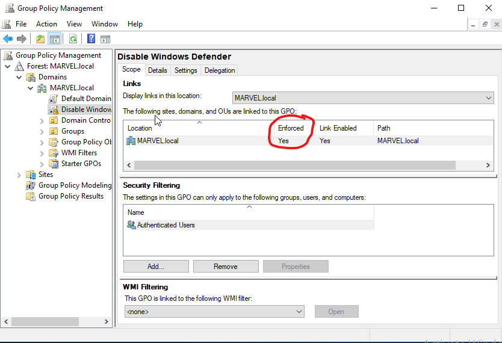

### Joining Our Machines to the Domain

Start up one of the Windows 10 Clients and login. Open up `File Explorer` and navigate to the `C:` drive. Create a new directory here called `Share`.

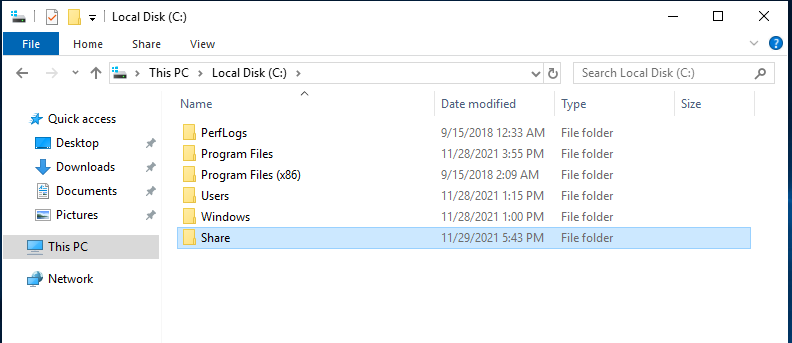

Right click the newly created `Share` directory and select `Properties`. Click the `Sharing` tab and the click `Share`. Click `Share` in the window that pops up and select `Yes, turn on network discovery and file sharing for all public networks` then `Done`.

Close that out and go back to your domain controller virtual machine. Open up the `Command Prompt`  and type `ipconfig` to get the IP of the domain controller. Once you have the IP switch back to the Windows 10 client and right click the Network icon at the bottom right then select `Open Network and Internet Settings`. Select `Change adapter options` and there should be a single `Ethernet` here. Right click it and select `Properties` then double click on the `Internet Protocol Version 4(TCP/IPv4)`. Leave the IP address to obtain automatically but switch `Obtain DNS server address automatically` to `Use the following DNS server addresses` and set the `Preferred DNS server` to that domain controller IP you just looked up with ipconfig then click `OK` on this window and the next.

Next click start and type `domain` and you should see the option `Access work or school`. Select it and click `Connect` then at the bottom you want to click `Join this device to a local Active Directory domain`. 

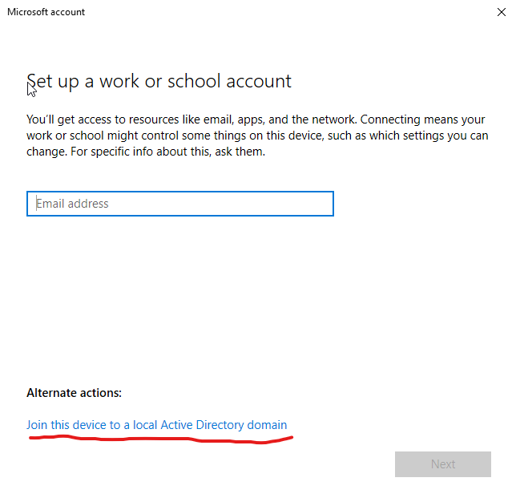

Enter the domain name you chose here. 

##### Note

- If you are using VirtualBox like me this is where you discover that leaving the 
    virtual machines setting to `NAT` gives them all the same IP. So you must open 
    VirtualBox and select `File`, then `Preferences`, then `Network` and click the 
    button to add a new NAT network.

- Then right click each of your machines and go to `Settings` then `Network` and change the `NAT` to `NAT Network`. The name field should update to the newly created NAT network but change it if it does not and click `OK`.

Next it asks for a user name and password. Type Administrator for the user name and whatever password you set for that account at the start. Click `Skip` at the next window and then `Restart Now`. 

After it boots back up to the login select `Other user` and enter the user information you setup on the domain controller using the first name initial and last name scheme and make sure its successful. 

Sign out then sign in as the user administrator `DOMAIN\administrator`. As we want to set the user to be an administrator on the local machine. Right click on start and select `Computer Management`. Click `Local Users and Groups` then double click `Groups`. Double click `Administrators` and then `Add` and type the user name into `Enter the object names to select` and make sure to click `Check Names` before hitting ok to make sure it found the user. Click `Apply` and `OK`.

Do the same for your other Windows 10 client machines. Making sure that the local user is an administrator of that machine and that your main user is an admin on all machines. 

Lastly go back to your Windows Server 2019 machine and open `Active Directory Users and Computers` and select `Computers`. You may have to click refresh but the Windows 10 client computers should all appear here now.

Congratulations! Your own active directory lab is fully set up. Time to get hacking!